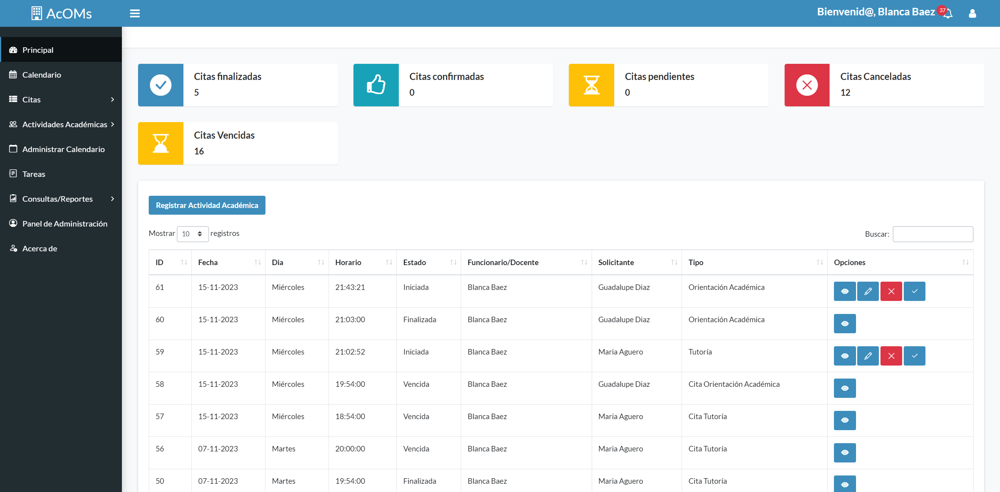
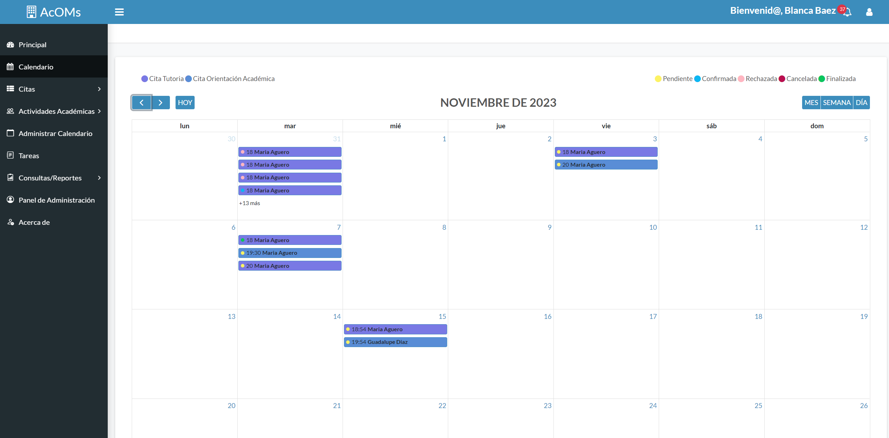
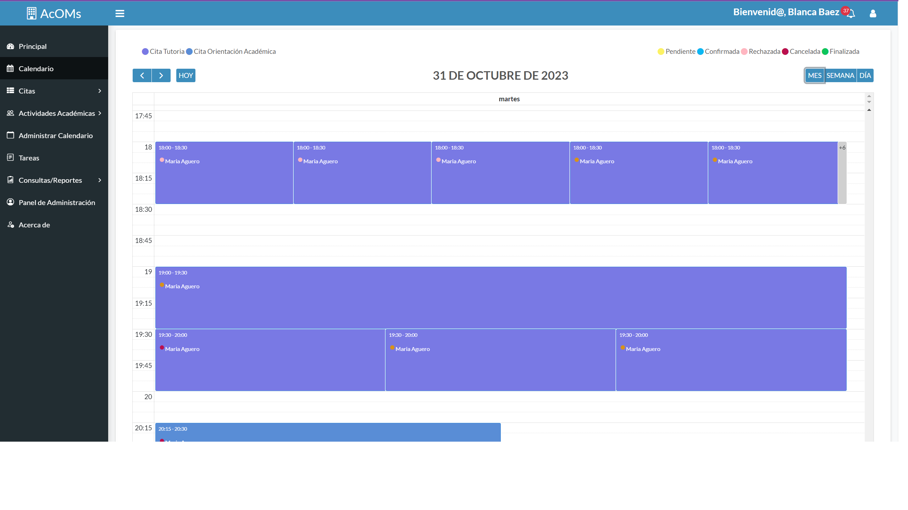
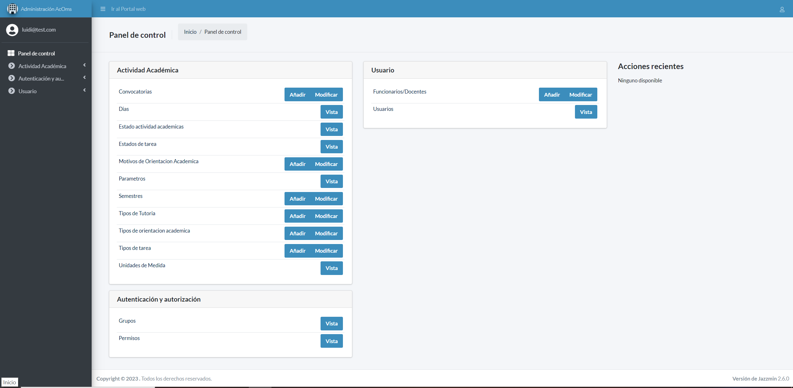

    <h1 align="center">Academic Orientation Management System</h1>

Welcome to my repository, here you will find a Project done for the "Universidad Autónoma de Asunción" that deals with the management of academic orientation activities (tutoring appointments and academic orientations) provided by the faculty for the students.

## Build and run the docker container

docker compose build && docker compose up

## 🚀 Documentation
### Project Structure
- **`credentials`**: to use the system you can find some basic credentials in the file `credentials.txt`.
- **`.env`**: you must create your own variable environments with this format:

.env: 
DESTINATARY_EMAIL=
SENDER_EMAIL=
SENDER_PASSWORD=
PGADMIN_DEFAULT_EMAIL=
PGADMIN_DEFAULT_PASSWORD=
TZ=
CELERY_BROKER_URL=
CELERY_BACKEND=
FLOWER_PORT=
SECRET_KEY=
-------------------------------------------------
.env.prod:
DEBUG=
SECRET_KEY=
DJANGO_ALLOWED_HOSTS=
SQL_ENGINE=
SQL_DATABASE=
SQL_USER=
SQL_PASSWORD=
SQL_HOST=
SQL_PORT=
DATABASE=
TZ=
FLOWER_LOCALE=

-------------------------------------------------

.env.prod.db:
POSTGRES_USER=
POSTGRES_PASSWORD=
POSTGRES_DB=
TZ=""

## 🤖 Tech stack
- [Django](https://www.djangoproject.com/) as the main development framework.
- [docker](https://www.docker.com/) to contain our services.
- [nginx](https://nginx.org/en/) our HTTP and reverse proxy server.
- [Celery](https://docs.celeryq.dev/en/stable/) responsible for the execution of asynchronous tasks for the collection of data from external service.
- [Redis](https://redis.io/) our message broker between django and celery.
- [flowers](https://flower.readthedocs.io/en/latest/) to supervise and manage Celery's tasks.

## Some System screenshots 

`Main View`

`Appointment Monthly Calendar`

`Appointment Daily Calendar`

`Main Administration view`

## 📜 License

Distributed under the MIT License. See [`LICENSE`](./LICENSE) for more information.
